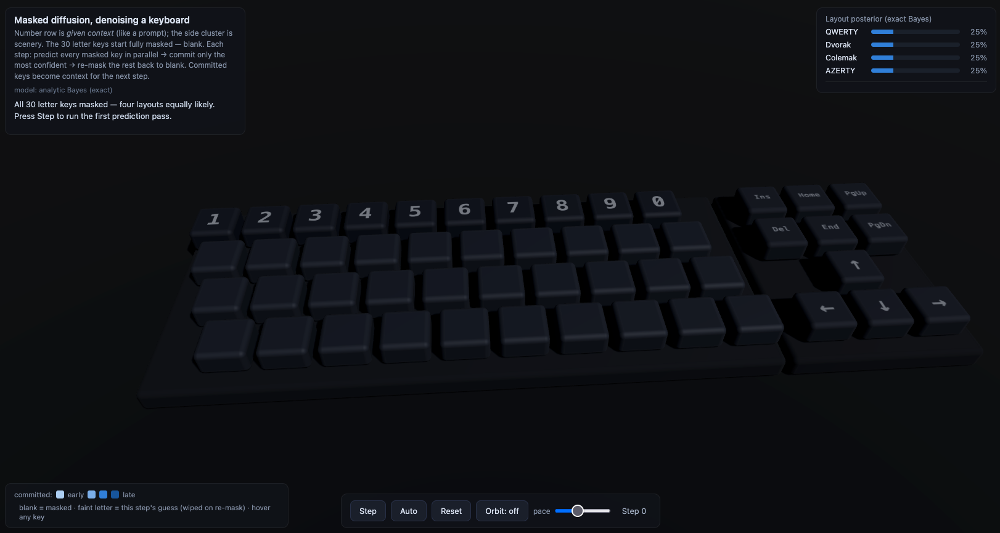

# Masked diffusion, denoised on a keyboard

A ~0.8M-parameter masked diffusion language model (the LLaDA-style core that
models like DiffusionGemma build on), trained on four keyboard layouts and
visualized as a 3D keyboard denoising itself in the browser.

Every key starts masked — blank. Each step, the model predicts all masked keys
in parallel, commits only the most confident, and re-masks the rest back to
blank. Committed keys become context for the next step — watch the posterior
panel as single commitments eliminate entire layouts. Reset and rerun: same
blank start, different layout emerges. That's the generative property.

## Build and run (~1 min on CPU)

    pip install -r requirements.txt
    python train.py              # writes keyboard_diffusion.pt
    python export_weights.py     # writes weights.json
    python -m http.server        # then http://localhost:8000

The HUD reads "trained net (pure-JS engine)" — a ~100-line plain-JavaScript
transformer in `index.html` runs the model in your browser. No ONNX, no
WebGPU, no runtime to install. It self-tests its forward pass against
reference logits baked into `weights.json` on load; if they mismatch it says
so and falls back to analytic Bayes rather than show you anything wrong.

(Needs a local server, not file:// — browsers block fetch of weights.json
over file://. Any static server works.)

## Terminal demo (no browser)

    python sample.py --show-steps    # ASCII board denoising step by step
    python sample.py --runs 8        # divergence: same start, different endings

## The two backends

The side posterior panel always shows exact Bayesian inference over the
four-layout library — the exact function the network learns to approximate.
With the trained net active, compare the per-key tooltips against it: they
track within a point or two. That small imperfection is the proof it's a
learned approximation, not the analytic answer — the transformer learned
Bayes' rule from examples. (Without weights.json the demo still runs entirely
on the analytic backend; the mechanism is identical, only the numbers differ.)

## Files

    index.html          3D demo + the ~100-line pure-JS inference engine
    model.py            bidirectional transformer mask-predictor
    train.py            the LLaDA recipe: t~U(0,1) masking, 1/t-weighted CE
    sample.py           confidence-based unmasking sampler, ASCII visualizer
    export_weights.py   packs trained weights + a self-test vector into weights.json
    requirements.txt    torch + numpy

## Notes

- The number row is fed as fixed context (like a prompt) — pre-filled, dim,
  never generated. The arrow/nav cluster is scenery, outside the generation
  canvas, like frozen context in a block-autoregressive model.
- A memorization-scale toy by design: it teaches the mechanism (parallel
  prediction, confidence commits, re-masking, collapse). Two caveats it shows
  on purpose: it starts as a fair dice roll because the prompt is uninformative
  (a real prompt loads the dice); and it hard-eliminates layouts because there
  are only four (a real model softly sharpens over a large vocabulary). The
  force underneath — committed tokens reshaping future predictions — is the
  same either way.

> [!NOTE]
> Training recipe follows [LLaDA](https://arxiv.org/abs/2502.09992). An
> educational reduction, not affiliated with it or DiffusionGemma.

## Model B — 5-letter words

The "generalization companion" the *Files* section alludes to:
`model_b_word_diffusion.py` swaps the four keyboard layouts for 8000
5-letter words and scales the transformer up to ~4.75M params. Same
recipe, much harder hypothesis space.

This is a fork of [OminousIndustries/KB-Diffusion](https://github.com/OminousIndustries/KB-Diffusion)
(Bijan Bowen). The fork — **KB-Diffusion-Optimized** — carries the
Model B results: script, training log, docs, and trained weights hosted
on Hugging Face at
[PastelRuntime/KB-Diffusion-ModelB](https://huggingface.co/PastelRuntime/KB-Diffusion-ModelB)
(GitHub public forks can't serve Git LFS, so the weights live on HF).

Full write-up of the Kaggle T4 run (loss/acc table, sampler comparison,
analytic-Bayes check, what to try next) is in
**[docs/model-b.md](docs/model-b.md)**.
